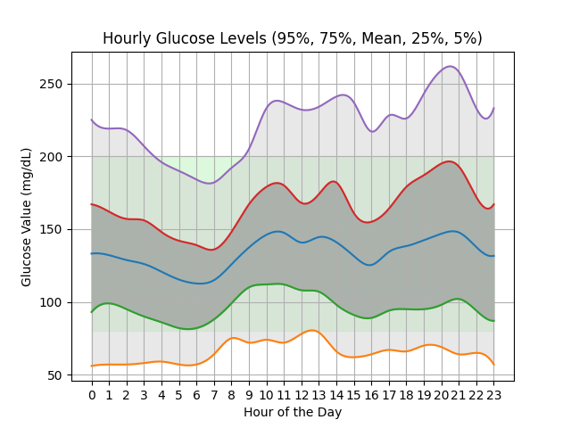

# DexCom Glucose Level Plot

This is a program that creates a plot of the exported DexCom data (a csv from
the clarity website). There are instructions on how to obtain the export on
[the dexcom FAQ page](https://www.dexcom.com/faqs/can-i-export-raw-data).
You might need to chose the right clarity website region. For europe it is
clarity.dexcom.eu (probably for the data protection reasons).

# Example

Running `./plot.py example/example_export_data.csv` produces this plot:



# Running the program

Follow the instructions in the **Development** section on how to install
the right python dependencies before running this program.

Then run the program by running `./plot.py <path-to-your-csv>`. Give it a
little time. Resulting plot will be in a file called plot.png`

```
❱ ./plot.py -h
usage: plot.py [-h] file_path

Plot hourly glucose levels from a CSV file.

positional arguments:
  file_path   Path to the CSV file

options:
  -h, --help  show this help message and exit
```

## Development

1. install [`uv`](https://github.com/astral-sh/uv)
2. create a venv in the project directory `uv venv` and follow instructions
3. install dependencies `uv pip install -r requirements.txt`

You are good to go.
